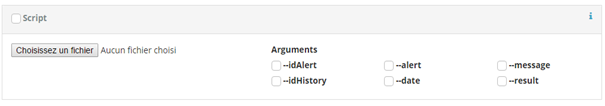
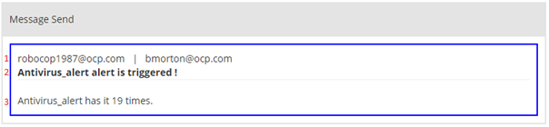

# Usage

## Overview

### Filter

You can filter the display of alerts according to different fields. If a field is in blue so the alert that match the value is display.

In this example, only alerts disable will be display.  


## Alert

Alert is an event that search periodic anomalies on the Elasticsearch. In this case, alert send a message to the user configured. It can execute a script to correct the incident.

### General

**Title**: Title of the alert. It has represents the alert for human readable, it cannot be null.  
**ID**: The id of the alert generated by Robocop.  
**Category**: Category configured in management page.  
**Severity**: Severity configured in management page.  
**Description**: Not use by the plugin. Only display information for the user.  
**Data**: A json object of various information set by the user to use it on the Robocop language (@[alert.data]) or in the script.  

### Watcher
  
**Search index**: Index of Elasticsearch where the alert is executed. It can be any index allows by Kibana (so index-* is valid). To help you, there are a list of all index in Elasticsearch. You can choose in the list or type another index.

**Periodicity**: The call frequency of the alert.
* 1 minute is call every minute.
* 10 minutes is call every 10 minutes at XXhX0.
* 30 minutes: call at XXh00 and XXh30.
* 1 hour: call at XXh00.
* 2 hours: call every 2 hours starting at 00H00
* 1 day: call every midnight
* 1 week: call every Monday at midnight
* 1 month: call the 1 of the month at midnight

Ex: a 12h00 there are “1 minute”,  “10 minutes”, ” 30 minutes”, ” 1 hour”, “2 hours” alert.

**Request**: Input request is the body of the search request. It must be a valid JSON.

Example:
``` json
{
  "query": {
    "bool": {
      "must": [{"match": {"field": "trigger"}},
      {"range": {"@timestamp":{"gte": "now-1h"}}}]
    }
  },
}
```

Robocop accept aggregation. Aggregation must have any valid name. Only the first aggregation is use for check if the alert is trigger. All aggregations are accessible in the mail and script.
``` json
{
  "query": { ... },
  "size": 0,
  "aggs": {
    "aggs_Name": {
      "terms": {
        "field": "field",
        "min_doc_count": 5
      }
    }
  }
}
```
Binoculars icon execute the request and display the results at the bottom of the page.   
If the request Input is not a valid search request or the index does not exist, the following message appear instead of result.  


If the check request button send back the following warning:  


Robocop does not find the indices in Elasticsearch. It happen during a typing error or when using a * in the name. The alert can be create.
* Verify the name of the index. Use the dropdown button.
* Ignore the warning If you use an “\*”

### Action

For each action, the binocular icon display a preview of the message configured.

#### Mail
To use mail, you need to enable in the configuration file of Kibana (cf configuration) and check the checkbox “Mail”.


**@ To**: Mail address to send the alert. You can write many addresses, use coma to separate address. If you want use coma in display name, enclose the name in double quotes.  
Examples: `foo@bar.com`, `"baz qux" <bazqux@bar.com>`, `foo@bar.com, "baz qux" <bazqux@bar.com>`, `"foo, bar" <foo@bar.com>`  
External documentation: https://nodemailer.com/message/addresses/


**@ From**: Mail address of the sender. If you want use coma in display name, enclose the name in double quotes.
External documentation: https://nodemailer.com/message/addresses/

**Subject**: The subject of the mail. It use the Robocop language.

**Body**: The body of the email. It uses the Robocop language. Icon below “body” copy the message from the other action tabs.

**Periodicity**: The priority of the mail.

#### Slack

To use mail, you need to enable in the configuration file of Kibana (cf configuration) and check the checkbox “Slack”.

**Canal**: Canal name or IM (direct message) to post alert message.
To know the direct message ID, you can use the Slack Web API (You need a basic access token).
1. Go to https://api.slack.com/methods/users.list/test and find the name of the bot.
1. Get the value of “id” of the bots (Uxxxxxxxx)
1. Open a direct message between the bot and the alert’s receiver to create the IM id.
1. Go to https://api.slack.com/methods/im.list/test and find the IM with the bot (find the bot id).
1. Copy the IM id in the input for the canal of slack.

**Bot name**: Name use by the bot to post a message.

**Body**: Message post on Slack. Use the Robocop language. Icon below “body” copy the message from the other action tabs.

#### Marvin
**Type**: Type of incident in Marvin.

**Title**: Title of incident.

**Contact**: Field contact in Marvin.

**Src of detection**: Field Detection source in Marvin.

**Src of alert**: Field Alert source in Marvin.

**Body**: Description of the incident.

### Script


See script section.

### Settings

**Enabled**: If uncheck, the alert is not execute.

**Multi message**: A message will be send for each aggregation return by the alert. Allows to create a different incident for each case.

**WH/NWH**: Select when the alert must be send action. The alert is executed 24/7 but send action only when it is active.
* WH: Send only on working hour configured in management page.
* NWH: Send action 24/7.
* Custom: Send configuration configured directly in the alert with *Active period* and *Days*.

**Active period**: Time when the daily alert send message. In standby, alert is execute but messages are not send and scripts are not execute. This action will done when the alert being active.
* From 08:00 to 20:00 ⇒ Alert active during the day.
* From 20:00 to 08:00 ⇒ Alert active during the night.

**Days**: List of days the alert must send action.

### Buttons bar

Buttons bar for a new alert:  


Buttons bar for an existing alert.  


**Save/Create**: Save the alert.

**Delete**: Delete definitively the alert.

**Duplicate**: Duplicate the alert.

**Check request**: Execute a basic check on the alert.
* Green alert: Every information is given.
* Yellow alert: Some optional information is missing or there are perhaps an error.
* Red alert: Some require information is missing. Alert cannot be save.
**Preview**: See the message send by the alert if it executed now.

**Debug**: Display the JSON of the alert, useful for action template.
**Log**: Go to the log page for this alert.

## History
### Information

The panel give information about the alert when it triggered.  


### Action panel

The panel give information about the actions enabled in the alert.

#### Message send
In these examples body are: “@[alert.title]\n@[alert.title] has it @[result.hits.total] times.”

Mail: (blue border)  


1. From | to
1. Object
1. Subject

Slack: (purple border)  


1. Bot name and body.

Marvin: (dark blue). Only body is display.

### Result

#### Hits
This table contain all elements return by the request. If you do not specify size in the request, Elasticsearch return by default 10 elements.


1. Search bar: search pattern in all field.
1. Show/hide column selector.
1. Column selector
1. Table fill with the result of the watcher.

Column selector allows you to show only several columns. Click on a field name to show/hide the column.

#### Aggregations
The table with only the aggregation. The table display only the basic aggregations without scrpted metric.

#### JSON
The result of the alert without any data processing.


## Cron

### General
**Title**: Title of the cron. It represent the cron, it cannot be null.

**Category**: Category of the cron. Can determine the purpose of the cron.

**Data** :A json object of various information set by the user to use it on the Robocop language (@[alert.data]) or in the script.

**Description**: Not use by the plugin. Only display information for the user.

### Scheduler

Select the periodicity and the date/time for the cron.

**WH/NWH**: Select when the alert must be send action. The alert is executed 24/7 but send action only when it is active.

* WH: Send only on working hour configured in management page.
* NWH: Send action 24/7.
* Custom: Send configuration configured directly in the alert with Active period and Days.

**Active period**: Time when the daily alert send message. In standby, alert is execute but messages are not send and scripts are not execute. This action will done when the alert being active.

* From 08:00 to 20:00 ⇒ Alert active during the day.
* From 20:00 to 08:00 ⇒ Alert active during the night.

**Days**: List of days the alert must send action.

### Settings

**Enabled**: Enable or disable the cron.

**Debug e-mail**: Email to send error.

### Request
The request executed by the cron. The request can any action supported by Elasticsearch.

1. Method HTTP (GET, POST, PUT, HEAD, DELETE)
1. Path Elasticsearch
1. Data of the request

You can use the console in Dev Tools to create your request and convert it to the cron.

### Script

See script section.

### Actions
Same as alert. Body is missing because is configured by the script.

### Buttons bar
Buttons bar for an existing alert.  


**Save/Create**: Save the cron.

**Delete**: Delete definitively the cron.

**Duplicate**: Duplicate the cron without the script.

**Check cron**: Execute a basic check on the cron.
* Green alert: Every information is given
* Yellow alert: Some optional information is missing
* Red alert: Some require information is missing. Alert cannot be save.

**Debug**: Display the JSON of the cron, useful for action template.

**Execute**: Execute the cron.

**Log**: Go to the log page for this cron.

## Management
### Backup

This panel is to create a snapshot of robocop index (data and log).

### Import / Export

Import or export all the data in json format.

### Manage
Manage  the backup of Robocop.

### Advanced option

Some options to configure Robocop. It allows to dynamically modify setting without restart Kibana.

## Log

To access to the log page, go to management page then log page in the navbar.


The *close* button return to the cron or overview page.  
Use the *info*, *warning*, *error* to filter the result as well as the timefilter.

* Info log has the blue info icon.
* Waring log has the yellow bolt icon.
* Error log has the red warning icon.
