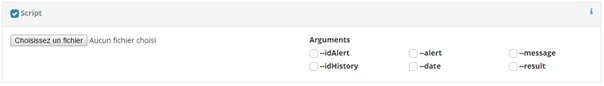

# Script

Alert and Cron allows you to run a script on the server when executed. In the case of alert, the script is run after the creation of the history.



## Create a script
The script have to respect some rules to be run by Robocop.
1. All dependencies/libraries must be installed on the server.
1. The script must be executable (Use the shebang, ex. add at start of the script: #!/usr/bin/python).
1. If the script is a unique file:
    1. The name can be anything (letter, number, classic symbol).
1. If you upload an archive:
    1. The main file must be name “run.XX” or “run”.
    1. Extension must be “zip”, “tar”, “tar.gz”, “tar.bz2”.

## Add a script

Check the script checkbox to enable the option. Then choose your script. The script must have a valid shebang. It will be upload when saving the alert.

## Remove the script
If you uncheck the checkbox, the script will be deleted when saving the alert or cron.

## Arguments
The Plugin can send to the script some data in arguments. See Robocop language to more detail.

| name      | Use case    | Description                                           |
|-----------|-------------|-------------------------------------------------------|
| idAlert   | Alert       | id Elasticsearch of the alert                         |
| idHistory | Alert       | id Elasticsearch of the history created for the event |
| date      | Alert, Cron | Date in ISO format                                    |
| alert     | Alert       | JSON of the alert object base64 encoded               |
| cron      | Cron        | JSON of the cron object base64 encoded                |
| idCron    | Cron        | id Elasticsearch of the cron                          |
| result    | Alert, Cron | JSON of the result of the request base64 encoded      |
| status    | Cron        | HTTP code of the request                              |
| preview   | Alert       | A special argument send if alert is on preview mode.  |


Example: The script is call like this (idAlert, date and alert enabled):

```
./script --idAlert [id] --date [data] --alert [base64(JSON([alert]))]
```

## Callback

The scripts can send back instruction to the plugin. The plugin have to write on stdout the instruction with JSON format.
Each instruction is a JSON object define by the field type.

``` json
[
  {
    "type": "data",
    "var1": "value1"
  }, {
    "type": "mail",
    ...
  }, {
    "type": "slack",
    ...
  },
  ...
]
```

### Slack
This instruction ask the plugin to post a message on slack.

``` json
{
  "type": "slack",
  "canal": "UXXXXXXXX",
  "body": "I am a super message. @[alert.title]"
}
```

If information is not set in the configuration, you must set the canal and the body of the message.
* canal: Default canal or IM to post message.
* body: Default message post on Slack. Use the Robocop language.

### Mail
This instruction ask to the plugin to send a mail.

``` json
{
  "type": "mail",
  "to": "receiver@mail.com",
  "from": "sender@mail.com",
  "smtphost": "server.mail.com",
  "smtpport": "25",
  "subject": "I’m a subject",
  "body": "I’m not the subject"
}
```

If information is not set in the configuration (alert or in thefile), you must set it.
* to: Mail address to send the alert. You can write many addresses, use coma to separate address. If you want use coma in display name, enclose the name in double quotes.
* From: Mail address of the sender. If you want use coma in display name, enclose the name in double quotes.
* subject: The subject of the email. It uses the Robocop language.
* body: The body of the email. It uses the Robocop language.

### Data

This instruction ask to the plugin to add new variables available for message in Robocop language

``` json
{
  "type": "data",
  "name1": "Value",
  "name2": 33
}
```

Use the tag @[script] to access to the variable.
For the example above:

```
@[script.name1] ⇒ Value
@[script.name2] ⇒ 33
```

## Develop a script in python 2.

To easily manage the data given by Robocop, you should use argparse and json library.
See the following example:

``` python
Import argparse
parser = argparse.ArgumentParser()
parser.add_argument("--date", required=True)
parser.add_argument("--preview", action="store_true")
argument = parser.parse_args()
print argument.date # ex: '2017-08-07T09:49:41.395Z'
Print argument.preview # ex: True
```

With an argument with a base64 encode use the following line:

```python
Import json, base64
alert = json.loads(base64.b64decode(str(argument.alert)))
To send data to Robocop, use the json library.
output = {}
# Fill the dictionnary.
print json.dumps(output)
```
